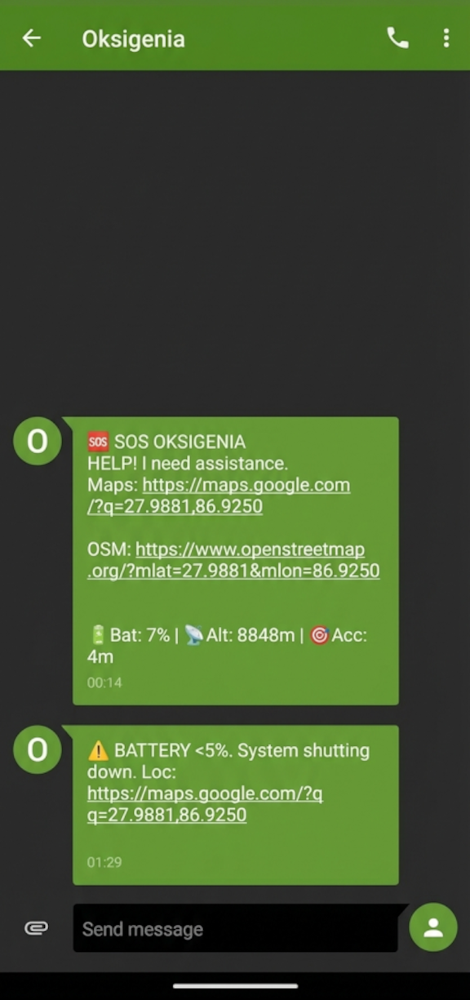

# Oksigenia SOS 🏔️ v3.9.5 "Immortal Sentinel"

**The Ultimate Outdoor Guardian | FOSS | Privacy-First | Autonomous**


<p align="center">
  <a href="https://apt.izzysoft.de/packages/com.oksigenia.oksigenia_sos">
    
  </a>
</p>

---

## 🦅 Why Oksigenia SOS?

When you are alone in the mountains, technology is your last line of defense. Most safety apps rely on internet connection, proprietary servers, or paid subscriptions. **Oksigenia SOS is different.**

It is an **autonomous bio-telemetry system** designed to detect life-threatening situations (severe falls or prolonged unconsciousness) and automatically trigger a rescue protocol using pure SMS.

* **No Servers:** Your data never leaves your phone.
* **No Internet:** Works via GSM/SMS (2G/3G/4G/5G).
* **No Accounts:** Install, configure, and you are protected.

---

## 📸 Visual Tour

The interface is designed for high-stress situations. High contrast, large touch targets for gloved hands, and clear status indicators.

| **Flight Deck** | **Fall Detected** | **Inactivity Alert** | **Configuration** |
|:---:|:---:|:---:|:---:|
|  |  |  |  |
| *Real-time telemetry & status* | *30s countdown before SMS* | *Triggered by lack of motion* | *Local contacts & settings* |

| **Test Mode** | **Alert Sent** | **SMS Payload** | **Localization** |
|:---:|:---:|:---:|:---:|
|  |  |  |  |
| *Safe testing environment* | *Confirmation screen* | *Direct GPS coordinates* | *8 Native languages* |

---

## 🚀 The v3.9.5 Saga: The Immortal Update

This version is not just an update; it is a complete re-engineering of the app's lifecycle. We have achieved **Total Decoupling** between the User Interface and the Sentinel Logic.

### 🏗️ Phase 1: Modernization
We have migrated the entire codebase to **Flutter 3.27+**.
* **Zero Technical Debt:** All deprecated libraries have been replaced.
* **Linter Compliance:** The code is clean, strict, and optimized for the latest Android runtimes.

### 💔 Phase 2: The "Great Decoupling"
Previously, the logic lived inside the screen. Now, they are divorced.
* **Headless Architecture:** The UI is now just a "Remote Control".
* **Service Independence:** If you close the UI, **the Service DOES NOT DIE**. It continues monitoring acceleration and inactivity in a separate Isolate.
* **Smart Reconnection:** When you open the app, it asks: *"Is a service already running?"* If yes, it connects to the live stream. If no, it initializes the system.

### 🧛 Phase 3: Deep Sleep Immunity (Wakelock)
We fought against Android's "Doze Mode" and won.
* **CPU Wakelock:** We implemented `wakelock_plus` logic within the background service. This forces the CPU to stay awake to process sensor data even when the screen is black and the phone is in deep sleep.
* **Zombie Recovery:** If an alarm triggers while the phone is locked, unlocking the screen instantly restores the `AlarmScreen` with the correct remaining time, synchronized with the background service. No more race conditions.

---

## 🧠 Core Features

| Feature | Technical Detail |
|:---|:---|
| **📊 Live Telemetry** | The footer displays real-time sensor data. **G-Force Meter** visualizes acceleration vector sum. **Battery Voltage** monitoring ensures you don't run dry. |
| **📐 Vector Physics** | We utilize **3D Vector Magnitude Calculation** ($\sqrt{x^2+y^2+z^2}$). This triggers only on genuine, high-energy impacts (>12G), filtering out running or jumping. |
| **🛡️ Permission Semaphores** | Instantly shows if you are safe. **Green:** Systems Go. **Red:** Critical permission missing. Clicking a red icon guides you to the specific Android setting. |
| **🌑 Dictatorship of Dark Mode** | Enforced pure dark theme (OLED friendly). Preserves night vision and maximizes battery life. Light mode is dead. |
| **🧟 Inactivity Monitor** | Now runs fully in the background. The service tracks micro-movements even with the screen off. If you stop moving for the configured time, the alarm triggers. |

---

## ⚠️ Critical Configuration

To guarantee 100% reliability, you must override Android's aggressive battery saving features.

### 🔋 1. Disable Battery Optimization
* **Why?** Android kills background apps to save power. We need the sensors awake.
* **How:** Long press App Icon > **App Info (i)** > **Battery** > Select **"Unrestricted"**.

### 🛡️ 2. Allow "Restricted Settings" (Android 13+)
* **Why?** To prevent malware, Android blocks apps from sending SMS automatically. You must authorize Oksigenia manually.
* **How:** Go to **Settings > Apps > Oksigenia SOS** > Tap **three dots (⋮)** (top right) > **"Allow restricted settings"**.

---

## 🌍 Global Availability

Oksigenia SOS is fully localized by native speakers:
* 🇬🇧 English
* 🇪🇸 Español
* 🇮🇹 Italiano
* 🇫🇷 Français
* 🇩🇪 Deutsch
* 🇵🇹 Português
* 🇳🇱 Nederlands
* 🇸🇪 Svenska

---

## 🛠️ Build & Contribute

We believe safety tools should be open and auditable.

### 📦 Download
Get the latest signed APKs from the **[Releases Section](https://github.com/OksigeniaSL/oksigenia-sos/releases)**.

### 💻 Build from Source
Requirements: **Flutter 3.27+**

```bash
git clone [https://github.com/OksigeniaSL/oksigenia-sos.git](https://github.com/OksigeniaSL/oksigenia-sos.git)
cd oksigenia-sos
flutter pub get
# Note: You need your own key.properties for release builds
flutter build apk --release --split-per-abi