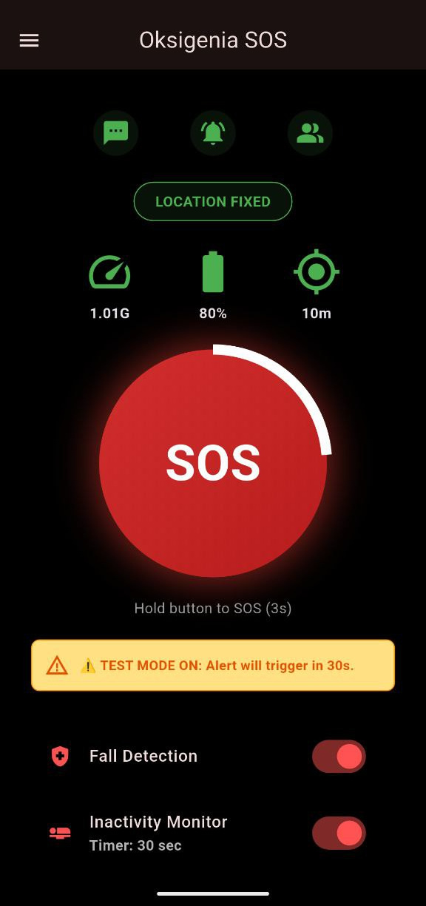

# Oksigenia SOS 🏔️ v3.9.2

**Outdoor Emergency Assistant | FOSS | Privacy-First**


[ES] **Oksigenia SOS** es una herramienta de seguridad personal diseñada para deportes de montaña y situaciones de riesgo. Detecta caídas o inactividad y envía SMS automáticos con coordenadas GPS y telemetría vital. Funciona de manera autónoma, sin depender de servidores externos.

[EN] **Oksigenia SOS** is a personal safety tool designed for mountain sports and risky situations. It detects falls or inactivity and sends automatic SMS with GPS coordinates and vital telemetry. It operates autonomously without relying on proprietary servers.

[](https://www.gnu.org/licenses/gpl-3.0)
[]()
[]()

<br>

<p align="center">
  <a href="https://apt.izzysoft.de/packages/com.oksigenia.oksigenia_sos">
    
  </a>
</p>

👉 **[Donate via PayPal / Donar con PayPal](https://www.paypal.com/donate/?business=paypal@oksigenia.cc&currency_code=EUR)** 💙

---

## 📸 Interface / Interfaz (v3.9.x)

| Dashboard | Impact Alert | Settings | Menu |
|:---:|:---:|:---:|:---:|
|  |  |  |  |

| Inactivity Alert | Test Mode | Languages | About / Legal |
|:---:|:---:|:---:|:---:|
|  |  |  |  |

---

## 🚀 Evolution v3.9.2 (Stability & Expansion)

| Feature | English | Español |
|:---|:---|:---|
| 🌍 **Global Core** | **8 Languages**. Full support added for **Italian, Dutch, and Swedish**, joining ES, EN, FR, PT, and DE. Automatic detection and cleaner selector UI. | **Núcleo Global**. 8 Idiomas. Soporte completo añadido para **Italiano, Neerlandés y Sueco**, uniéndose a ES, EN, FR, PT y DE. Detección automática y selector limpio. |
| 🚥 **Visual Telemetry** | **G-Force Traffic Light**. The G-Force monitor now changes color dynamically (**Green/Yellow/Red**) to visualize movement intensity. Grey icon indicates privacy sensors blocked (GrapheneOS friendly). | **Semáforo de Fuerza G**. El monitor cambia de color dinámicamente (**Verde/Amarillo/Rojo**) para visualizar la intensidad. Icono gris indica sensores bloqueados (Compatible GrapheneOS). |
| 🧠 **Smart Filters** | **Anti-Noise Algorithm**. New **0.15G threshold** filter to ignore engine vibrations or table bumps. Sylvia now only wakes up for real human movement. | **Filtros Inteligentes**. Nuevo filtro con **umbral de 0.15G** para ignorar vibraciones de motor o golpes en mesa. Sylvia solo despierta con movimiento humano real. |
| 🎨 **Theme Identity** | **Android 13+ Ready**. Full support for **Monochrome / Themed Icons**. The app icon now adapts to your wallpaper color palette for a seamless home screen look. | **Integración Android 13+**. Soporte total para **Iconos con Tema / Monocromáticos**. El icono se adapta a la paleta de colores de tu fondo de pantalla. |
| 🌑 **Native Dark Mode** | **Sleek & Tactical**. Fixed startup flashes. The interface uses pure blacks and high-contrast accents to reduce glare during night operations and save battery. | **Modo Oscuro Nativo**. Adiós a los parpadeos blancos. Interfaz de alto contraste y negros puros para operaciones nocturnas y ahorro de batería. |
| 🚨 **Circular UX** | **Stress-Free Alerts**. Dynamic red circular indicator for alarms. It clearly shows if the trigger was an **Impact** or **Inactivity**, reducing anxiety during false alarms. | **Alertas Sin Estrés**. Indicador circular rojo dinámico. Muestra claramente si la causa fue **Impacto** o **Inactividad**, reduciendo la ansiedad ante falsas alarmas. |

---

## ⚠️ Critical Configuration / Configuración Crítica

### 🔋 1. Battery Optimization / Optimización de Batería
[EN] To ensure sensors and GPS never "sleep", you **must** disable battery optimization:
[ES] Para asegurar que los sensores y el GPS no se "duerman", **debes** desactivar la optimización:

1. Long press icon > **App Info (i)** / Mantén pulsado icono > **Información (i)**.
2. Go to **App battery usage** / Ve a **Uso de batería**.
3. Select **"Unrestricted"** / Selecciona **"Sin restricciones"**.

### 🛡️ 2. "Restricted Settings" (Android 13+)

[ES] Si ves un aviso de "Ajustes Restringidos" al activar los SMS:
1. Ve a **Ajustes > Apps > Oksigenia SOS**.
2. Pulsa los **tres puntos (⋮)** (arriba derecha) -> **"Permitir ajustes restringidos"**.

[EN] If you see a "Restricted Setting" warning when enabling SMS:
1. Go to **Settings > Apps > Oksigenia SOS**.
2. Tap **three dots (⋮)** (top right) -> **"Allow restricted settings"**.

<br clear="right"/>

---

## 🛠️ Download & Build

### 📦 Download APK
Check the **[Releases Section](https://github.com/OksigeniaSL/oksigenia-sos/releases)** for the latest signed APKs.

### 💻 Build from source
```bash
git clone [https://github.com/OksigeniaSL/oksigenia-sos.git](https://github.com/OksigeniaSL/oksigenia-sos.git)
cd oksigenia-sos
flutter pub get
# Create your key.properties first!
flutter build apk --release --split-per-abi