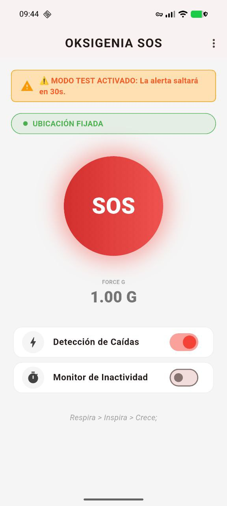
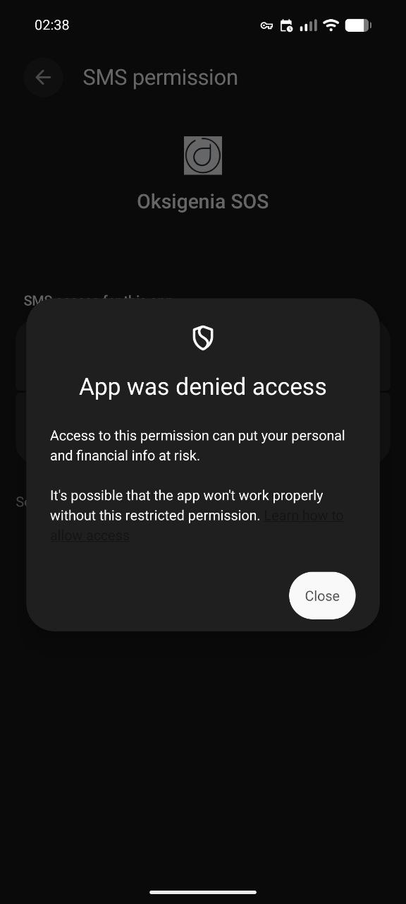

# Oksigenia SOS 🏔️

**Outdoor Emergency Assistant | FOSS | Privacy-First**

[ES] Oksigenia SOS es una herramienta de seguridad personal diseñada para deportes de montaña y situaciones de riesgo. Detecta caídas o inactividad y envía SMS automáticos con coordenadas GPS. Funciona de manera autónoma, sin depender de servicios privativos.

[EN] Oksigenia SOS is a personal safety tool designed for mountain sports and risky situations. It detects falls or inactivity and sends automatic SMS with GPS coordinates. It operates autonomously without relying on proprietary services.

[](https://opensource.org/licenses/MIT)
[]()
[]()

👉 **[Donate via PayPal / Donar con PayPal](https://www.paypal.com/donate/?business=paypal@oksigenia.cc&currency_code=EUR)** 💙

---

## 📸 Screenshots / Capturas

| Home (v3.6) | Menu | Alert |
|:---:|:---:|:---:|
|  |  |  |
| **Success / Enviado** | **FOSS / Donate** | **Legal** |
|  |  |  |

---

## ✨ New in v3.6.0 / Novedades

| Feature | English | Español |
|:---|:---|:---|
| 🛡️ **Privacy Hardening** | **Removed Google Play Services**. Now uses raw GPS hardware directly via `forceLocationManager`. | **Eliminado Google Play Services**. Ahora usa el chip GPS directamente por hardware. |
| 📳 **Vibration Alert** | Haptic feedback added to the acoustic alarm for better awareness in pockets. | Añadida vibración potente junto a la sirena acústica para mayor seguridad. |
| 🧪 **Test Mode** | Added a **30-second mode** to safely test the Inactivity Monitor without waiting 1 hour. | Nuevo **Modo Test de 30s** para probar el sensor de inactividad de forma segura. |
| 🌍 **Multi-language** | Full support for **EN, ES, FR, PT, DE**. Auto-detects phone prefix. | Soporte completo **EN, ES, FR, PT, DE**. Detección automática de prefijo. |

---

## ⚠️ Troubleshooting: "Restricted Settings" (Android 13+)



### 🇪🇸 Español
Si instalas el APK manualmente y ves este aviso al activar los SMS, es una medida de seguridad de Android. **La app funciona correctamente**, solo necesitas autorizarla:

1. Ve a **Ajustes > Apps > Oksigenia SOS**.
2. Pulsa los **tres puntos (⋮)** (esquina superior derecha).
3. Selecciona **"Permitir ajustes restringidos"**.
4. Vuelve a la app y activa el permiso de SMS.

<br clear="right"/>

### 🇺🇸 English
If you sideload the APK and see this warning when enabling SMS, it is an Android security feature. **The app works correctly**, you just need to authorize it manually:

1. Go to **Settings > Apps > Oksigenia SOS**.
2. Tap the **three dots (⋮)** (top right corner).
3. Select **"Allow restricted settings"**.
4. Return to the app and grant the SMS permission.

---

## 🚀 Key Features / Funciones Principales

| Feature | English | Español |
|:---|:---|:---|
| 👥 **Multi-contact** | Add multiple emergency contacts. The first one receives live tracking. | Añade varios contactos de emergencia. El primero recibe el seguimiento en vivo. |
| 📍 **Live Tracking** | Sends periodic GPS updates every 30, 60, or 120 min after the SOS. | Envía actualizaciones GPS periódicas cada 30, 60 o 120 min tras el SOS. |
| ✍️ **Custom Message** | Edit the SOS text to include medical info or route details. | Edita el texto de SOS para incluir info médica o detalles de la ruta. |
| ⏱️ **Adjustable Timer** | Configurable inactivity limit: 30s (Test), 1h (Default), or 2h. | Límite de inactividad configurable: 30s (Test), 1h (Normal) o 2h. |
| 📉 **Fall Detection** | Detects severe impacts (>3.5G) using the accelerometer. | Detecta impactos severos (>3.5G) usando el acelerómetro. |
| 🔒 **Privacy** | 100% Offline. No registration, no tracking, no servers. | 100% Offline. Sin registro, sin rastreo, sin servidores. |

---

## 🛠️ Download & Build

### 📦 Download APK
Check the **[Releases Section](https://github.com/Oksigenia/oksigenia-sos/releases)** for the latest signed APKs.

### 💻 Build from source
```bash
git clone [https://github.com/Oksigenia/oksigenia-sos.git](https://github.com/Oksigenia/oksigenia-sos.git)
flutter pub get
flutter build apk --release --split-per-abi
