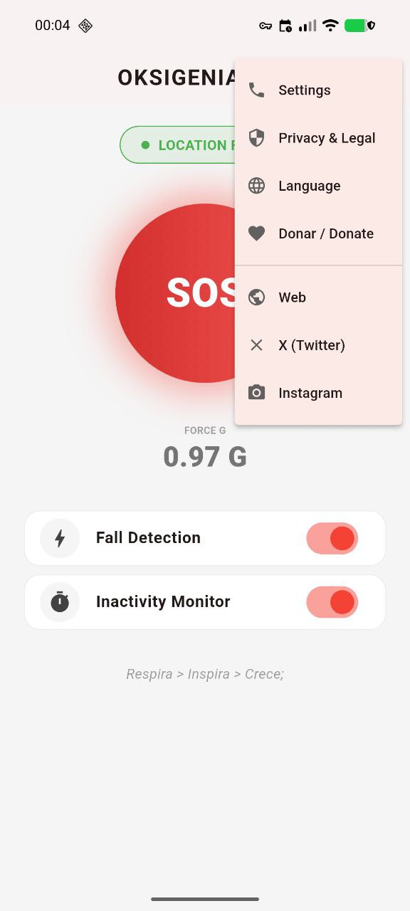
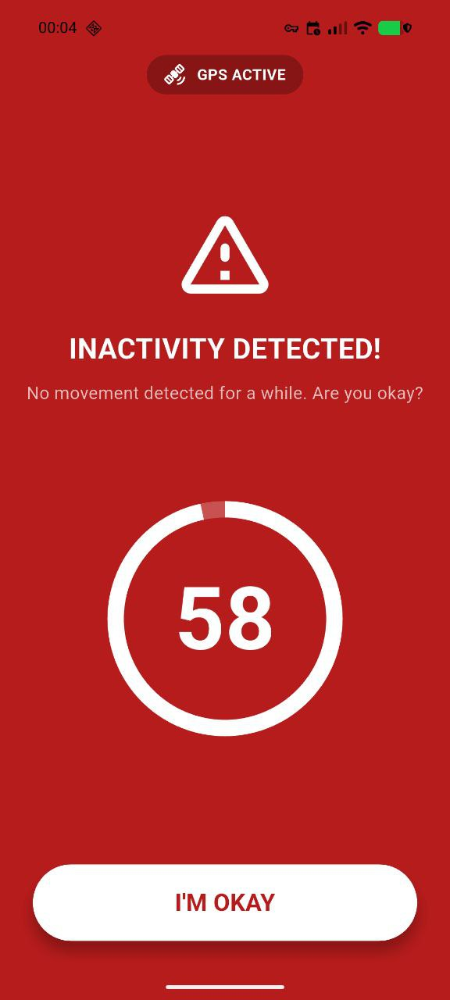
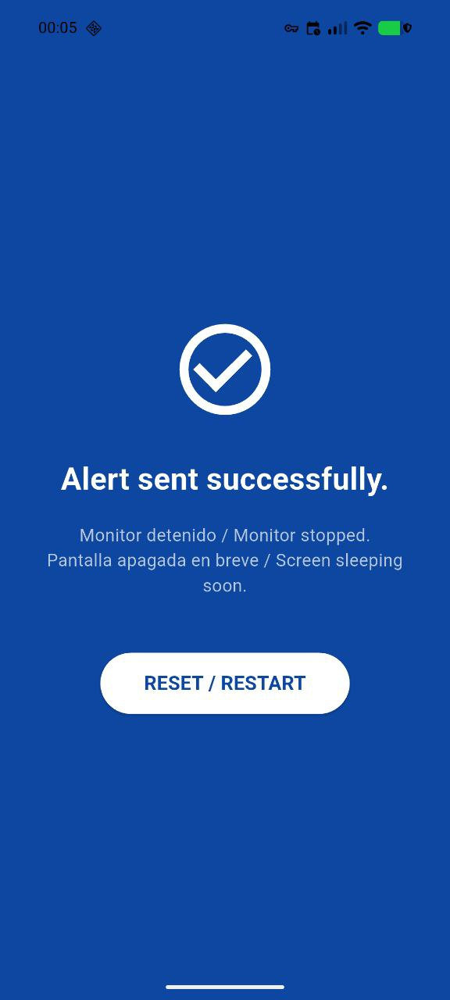
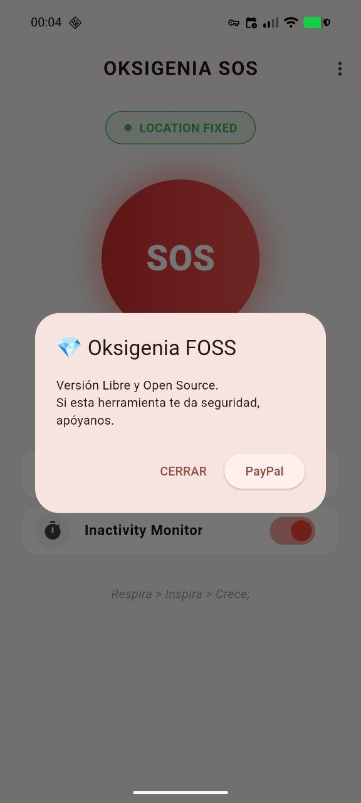
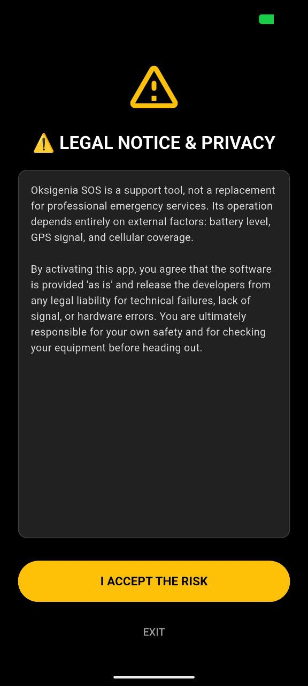

# Oksigenia SOS 🏔️

**Outdoor Emergency Assistant | FOSS | Privacy-First**

Oksigenia SOS es una herramienta de seguridad personal diseñada para deportes de montaña, trabajadores aislados y situaciones de riesgo. Funciona de manera autónoma, sin depender de servidores externos ni servicios privativos.

[](https://opensource.org/licenses/MIT)
[]()
[](https://flutter.dev)

---

## 📸 Screenshots

| Home & Status | Settings & Privacy |
|:---:|:---:|
|  |  |
| **Monitor en Tiempo Real**<br>Visualización de Fuerza G y Estado GPS | **Menú Rápido**<br>Acceso a privacidad y donaciones |

| Alerta Activa | Envío Confirmado |
|:---:|:---:|
|  |  |
| **Pre-Alerta (60s)**<br>Sirena de alta potencia + Wakelock | **Modo Ahorro Batería**<br>Confirmación visual y parada de sensores |

| FOSS & Comunidad | Legal & Disclaimer |
|:---:|:---:|
|  |  |
| **Open Source**<br>Sin rastreadores. Financiado por la comunidad | **Responsabilidad**<br>Aviso legal claro antes de iniciar |

---

## 🚀 Características Principales (v4.4)

* **Detección de Caídas (Fall Detection):** Utiliza el acelerómetro para detectar impactos severos (>3.5G) y activar la alarma automáticamente.
* **Monitor de Inactividad (Dead Man's Switch):** Si no detecta movimiento durante **60 minutos** (configurable), inicia el protocolo de emergencia.
* **Independencia de Google:** Utiliza el chip GPS por hardware (`forceLocationManager`). Funciona en GrapheneOS, LineageOS y dispositivos sin Google Play Services.
* **Protocolo de Batería:**
    * Durante la alerta: Mantiene la pantalla encendida y fuerza el audio al máximo (Stream Alarm).
    * Tras el envío: Libera la pantalla y detiene sensores para maximizar la supervivencia de la batería.
* **Privacidad Total:** No hay registro, no hay base de datos, no hay rastreo. Los datos solo salen de tu teléfono vía SMS a tu contacto de confianza.

## 🛠️ Instalación y Compilación

Este proyecto es 100% Flutter. Para compilarlo necesitas el SDK de Flutter y Android Studio/VS Code.

```bash
# 1. Clonar el repositorio
git clone [https://github.com/tu-usuario/oksigenia-sos.git](https://github.com/tu-usuario/oksigenia-sos.git)

# 2. Instalar dependencias
flutter pub get

# 3. Compilar APK (Release)
flutter build apk --release
