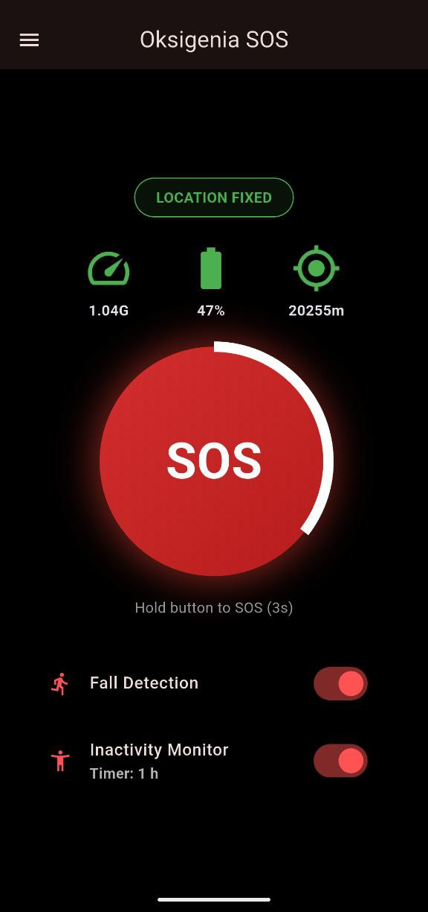
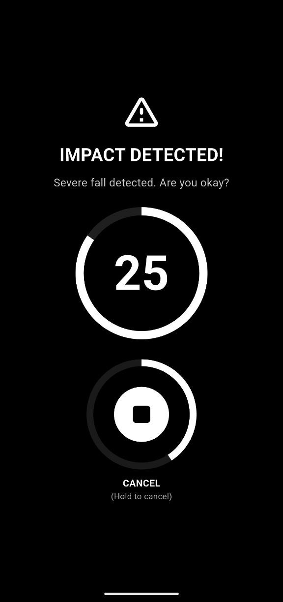
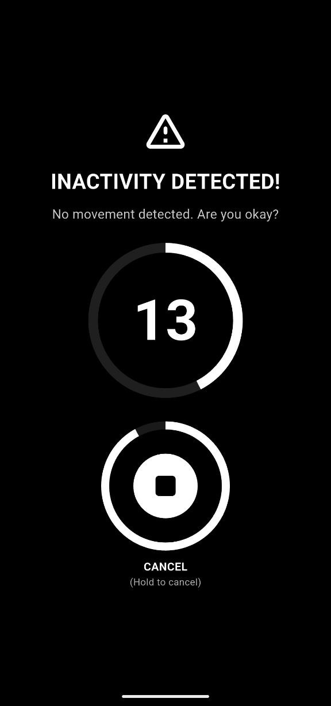
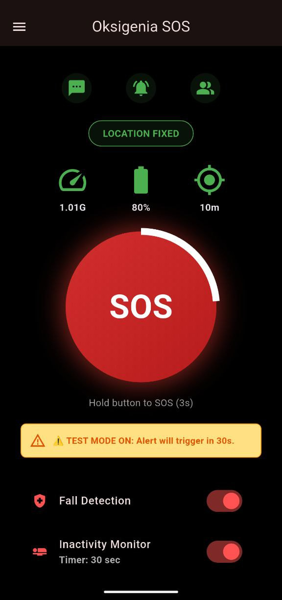
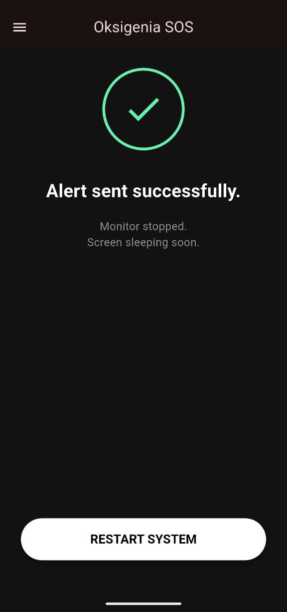
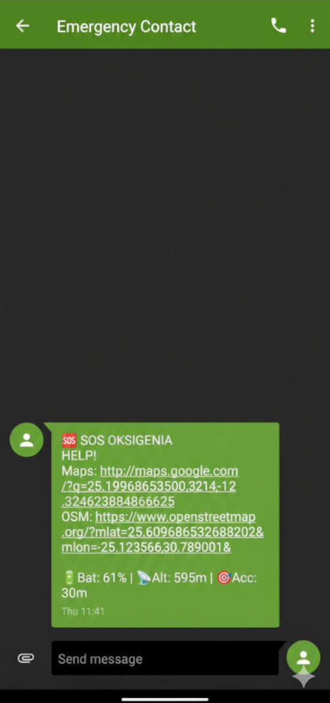
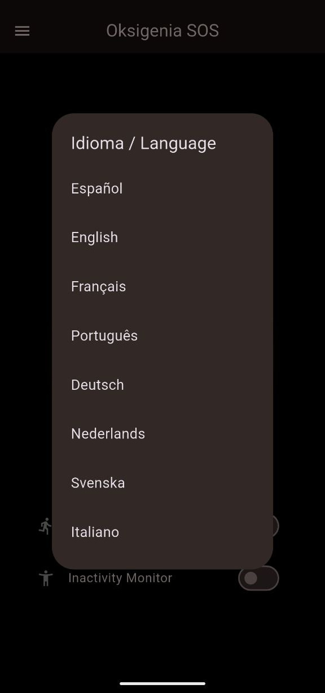

# Oksigenia SOS 🏔️ v3.9.5 "Immortal Sentinel"

**The Ultimate Outdoor Guardian | FOSS | Privacy-First | Autonomous**


<p align="center">
  <a href="https://apt.izzysoft.de/packages/com.oksigenia.oksigenia_sos">
    
  </a>
</p>

---

## 🦅 Why Oksigenia SOS?

When you are alone in the mountains, technology is your last line of defense. Most safety apps rely on internet connection, proprietary servers, or paid subscriptions. **Oksigenia SOS is different.**

It is an **autonomous bio-telemetry system** designed to detect life-threatening situations (severe falls or prolonged unconsciousness) and automatically trigger a rescue protocol using pure SMS.

* **No Servers:** Your data never leaves your phone.
* **No Internet:** Works via GSM/SMS (2G/3G/4G/5G).
* **No Accounts:** Install, configure, and you are protected.

---

## 📸 Visual Tour

The interface is designed for high-stress situations. High contrast, large touch targets for gloved hands, and clear status indicators.

| **Flight Deck** | **Fall Detected** | **Inactivity Alert** | **Configuration** |
|:---:|:---:|:---:|:---:|
|  |  |  |  |
| *Real-time telemetry & status* | *30s countdown before SMS* | *Triggered by lack of motion* | *Local contacts & settings* |

| **Test Mode** | **Alert Sent** | **SMS Payload** | **Localization** |
|:---:|:---:|:---:|:---:|
|  |  |  |  |
| *Safe testing environment* | *Confirmation screen* | *Direct GPS coordinates* | *8 Native languages* |

---

## 🚀 The v3.9.5 Saga: The Immortal Update

This version is not just an update; it is a complete re-engineering of the app's lifecycle and its survival under real field conditions.

### 🏗️ Phase 1: Modernization
We have migrated the entire codebase to **Flutter 3.38**.
* **Zero Technical Debt:** All deprecated libraries have been replaced.
* **Linter Compliance:** The code is clean, strict, and optimized for the latest Android runtimes.

### 💔 Phase 2: The "Great Decoupling"
Previously, the logic lived inside the screen. Now, they are divorced.
* **Headless Architecture:** The UI is now just a "Remote Control".
* **Service Independence:** If you close the UI, **the Service DOES NOT DIE**. It continues monitoring acceleration and inactivity in a separate Isolate.
* **Smart Reconnection:** When you open the app, it asks: *"Is a service already running?"* If yes, it connects to the live stream. If no, it initializes the system.

### 🧛 Phase 3: Deep Sleep Immunity
We fought against Android's Doze Mode and won.
* **CPU Wakelock:** The background service holds a `PARTIAL_WAKE_LOCK` (native Android) to keep the CPU alive for sensor processing even in deep sleep.
* **Battery Gate:** Monitoring cannot be activated unless the app is exempt from battery optimization. This is not a warning — it is a hard block. A single tap opens the system setting to fix it.
* **Zombie Recovery:** If an alarm triggers while the phone is locked, the system recovers instantly on unlock with the correct remaining countdown.

### 🔔 Phase 4: The Alarm Breaks Through
The alarm is now a true emergency signal, not just a notification.
* **Lock Screen Override:** When a fall or inactivity alarm triggers, the app appears directly on top of the lock screen using Android's `fullScreenIntent`. The user can cancel the alarm **without unlocking the phone** — critical when wearing gloves or in cold conditions.
* **No More Frozen Screenshot:** The lock screen no longer shows a static, non-interactive snapshot of the app UI. Normal lock behavior is fully restored when no alarm is active.
* **Screen-On Guarantee:** The alarm forces the screen on and keeps it lit for the full 30-second countdown window.

### 🧠 Phase 5: Smart Sentinel
Intelligent fall detection that eliminates false positives from physical activity.
* **Impact → Observation:** A >3.5G impact does not trigger the alarm immediately. It opens a **60-second silent observation window**.
* **Rhythmic Movement Detection:** Every 2 seconds, the service analyzes the last 60 sensor samples. If it detects rhythmic acceleration crossings (walking, running, cycling), it classifies the event as a false positive and resets silently.
* **True Fall Confirmation:** Only sustained absence of rhythmic movement for 60 seconds triggers the alarm. Falls while hiking, scrambling, or riding do not cause false alerts.
* **Re-arm After Cancel:** The Sentinel re-arms correctly after the user cancels an alarm. The sensor buffer is cleared on reset to prevent stale data from contaminating the next analysis cycle.

---

## 🧠 Core Features

| Feature | Technical Detail |
|:---|:---|
| **📊 Live Telemetry** | The footer displays real-time sensor data. **G-Force Meter** visualizes acceleration vector sum. **Battery** monitoring triggers an emergency "Dying Gasp" SMS at <5%. |
| **📐 Vector Physics** | **3D Vector Magnitude Calculation** ($\sqrt{x^2+y^2+z^2}$). Smart Sentinel filters walking, running, and cycling as false positives before triggering. |
| **🛡️ Permission Semaphores** | Instantly shows if you are safe. **Green:** Systems Go. **Red:** Critical permission missing. Tapping guides you to the specific Android setting. |
| **🌑 Dictatorship of Dark Mode** | Enforced pure dark theme (OLED friendly). Preserves night vision and maximizes battery life. |
| **🧟 Inactivity Monitor** | Runs fully in the background. Tracks micro-movements even with the screen off. Configurable timeout (hours). |
| **🪫 Dying Gasp** | At battery <5%, automatically sends an SMS with last known GPS coordinates before power death. |

---

## ⚠️ Critical Configuration

These settings are **required** for Oksigenia SOS to function reliably in the field. The app will not allow monitoring to start until they are configured.

### 🔋 1. Battery Optimization — Unrestricted (Mandatory)
* **Why?** Android kills background processes to save power. Without this, the Sentinel dies after a few hours of inactivity.
* **How:** Long press App Icon → **App Info** → **Battery** → Select **"Unrestricted"** (or "Don't optimize").
* The monitoring toggle will not activate until this is set. Tapping the battery icon opens the correct setting directly.

### 📺 2. Full-Screen Notifications — Allow (Mandatory on Android 14+)
* **Why?** Required for the alarm to appear on top of the lock screen without manual unlock.
* **How:** Go to **Settings → Apps → Oksigenia SOS → Full-screen notifications** → Enable.
* Without this, the alarm audio still plays but the screen does not wake automatically.

### 🛡️ 3. Allow "Restricted Settings" (Android 13+)
* **Why?** Android blocks apps from sending SMS automatically. You must authorize Oksigenia manually.
* **How:** Go to **Settings → Apps → Oksigenia SOS** → Tap **three dots (⋮)** → **"Allow restricted settings"**.

---

## 🌍 Global Availability

Oksigenia SOS is fully localized in 8 languages:
* 🇬🇧 English
* 🇪🇸 Español
* 🇮🇹 Italiano
* 🇫🇷 Français
* 🇩🇪 Deutsch
* 🇵🇹 Português
* 🇳🇱 Nederlands
* 🇸🇪 Svenska

---

## 🛠️ Build & Contribute

We believe safety tools should be open and auditable.

### 📦 Download
Get the latest signed APKs from the **[Releases Section](https://github.com/OksigeniaSL/oksigenia-sos/releases)**.

### 💻 Build from Source
Requirements: **Flutter 3.38.7** (exact version — required for Reproducible Builds)

```bash
git clone https://github.com/OksigeniaSL/oksigenia-sos.git
cd oksigenia-sos
flutter pub get
# Note: You need your own key.properties for release builds
flutter build apk --release --split-per-abi --no-shrink
```
