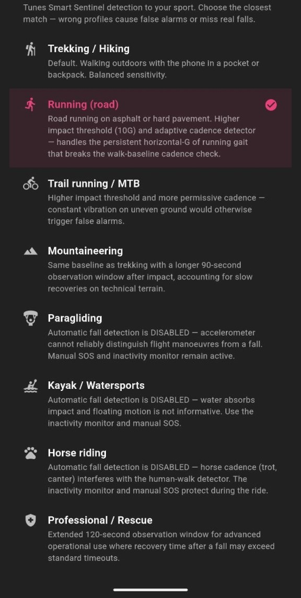
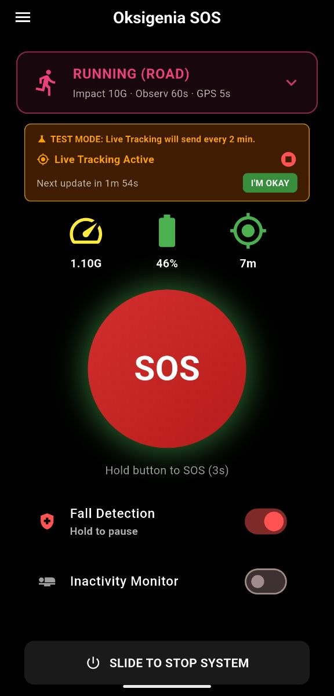

# Oksigenia SOS 🏔️ v4.2.5 "Running"

**The Ultimate Outdoor Guardian | FOSS | Privacy-First | Autonomous**


<p align="center">
  <a href="https://f-droid.org/packages/com.oksigenia.oksigenia_sos">
    
  </a>
  <a href="https://apt.izzysoft.de/packages/com.oksigenia.oksigenia_sos">
    
  </a>
</p>

<p align="center"><sub>Same developer signature on F-Droid, IzzyOnDroid and GitHub — install from any source, update from any other.</sub></p>

---

## 🦅 Why Oksigenia SOS?

When you are alone in the mountains, technology is your last line of defense. Most safety apps rely on internet connection, proprietary servers, or paid subscriptions. **Oksigenia SOS is different.**

It is an **autonomous bio-telemetry system** designed to detect life-threatening situations (severe falls or prolonged unconsciousness) and automatically trigger a rescue protocol using pure SMS.

* **No Servers:** Your data never leaves your phone.
* **No Internet:** Works via GSM/SMS (2G/3G/4G/5G).
* **No Accounts:** Install, configure, and you are protected.

---

## 📸 Visual Tour

The interface is designed for high-stress situations. High contrast, large touch targets for gloved hands, and clear status indicators.

| **Flight Deck** | **Activity Profiles** | **Configuration** | **Live Tracking** |
|:---:|:---:|:---:|:---:|
|  |  |  |  |
| *Profile hero & real-time telemetry* | *8 sport presets tune Smart Sentinel* | *Contacts, message & profile* | *Periodic check-ins with "I'm OK"* |

| **Fall Detected** | **Inactivity Alert** | **Alert Sent** | **SMS Payload** |
|:---:|:---:|:---:|:---:|
|  |  |  |  |
| *30s countdown before SMS* | *Triggered by lack of motion* | *Confirmation screen* | *Direct GPS coordinates* |

| **Test Mode** | **Localization** |
|:---:|:---:|
|  |  |
| *Safe testing environment* | *11 native languages* |

---

## 🔋 What's New in v4.2.4: battery fix

When you turn monitoring off, the background service now stops completely and releases its wakelock, instead of staying alive and keeping the device awake. Before, with detection disabled, it could quietly drain the battery — hours of charge lost outdoors with nothing watching in return. After a reboot it now revives on its own only if monitoring was actually on. The persistent notification no longer beeps on every action, and the (rarely used) home-screen panic widget was removed since its background polling was part of the drain. Validated on device; same signing key, updates cleanly.

---

## 🪶 What's New in v4.2.3: leaner build

v4.2.3 enables R8 code and resource shrinking, which strips Flutter's unused Google Play Core (deferred components) classes — code the app never used. The APK is now fully free of Play Store delivery code and about 3 MB lighter, with no functional changes. Validated on device (monitoring, fall detection, SOS SMS, reboot persistence, widgets). Same signing key, so it updates cleanly over any earlier install.

---

## 🔁 What's New in v4.2.2: verifiable builds

v4.2.2 is a build-only release with no functional changes. The release workflow now builds with JDK 21 to match the F-Droid buildserver, so the published APK is byte-for-byte reproducible from source. Same signing key across every source, so it updates cleanly over any earlier install.

---

## 🔒 What's New in v4.2.1: genuinely Google-free

The `geolocator` plugin was quietly pulling in Google Play Services (`play-services-location`) as a hard dependency, so previous APKs shipped GMS location code even though the app forces Android's native location at runtime. v4.2.1 replaces `geolocator_android` with its FLOSS fork, which removes that path entirely.

- The APK is now actually GMS-free — your location never goes through Google services.
- No functional change on de-Googled phones (they already used the native `LocationManager` path); outdoors, behaviour is identical everywhere.
- Same signing key, so it updates cleanly over any earlier install and stays reproducible.

---

## 🏃 What's New in v4.2.0: Running profile & reliability

### 🏃 Running (road) profile
Eighth activity profile, tuned for road running. Field telemetry showed that sustained running keeps the G-signal permanently elevated (mean 1.6–2.8 G), which the walking-calibrated cadence detector read as "no movement" — a false-alarm trap. The new profile adds an **adaptive rhythm detector**: in a clearly elevated regime it re-evaluates cadence over the moving mean instead of the fixed walking threshold. Yellow 10 G, 60 s observation, GPS 5 s / 10 m. Validated across a multi-surface field route (trekking, road running, trail).

### 🏠 Redesigned Home
Profile hero card with the active parameters at a glance, a single context-aware alert banner (replacing the old status pills), and confirm-on-switch when changing profiles — with a warning when the target profile disables automatic fall detection.

### 📡 Smart Beacon — stoppable & clearer
The post-SOS position beacon can now be stopped directly from the Home screen — a tap on its banner — without shutting down monitoring. Its SMS now states plainly that it is an **automatic follow-up to the emergency alert, not a new alarm**, so the recipient is never confused.

### 🛰️ Background location, explained
The app now requests "Allow all the time" location with a plain-language rationale: when the alarm fires with the phone in a pocket and the screen off, Android can otherwise deny a fresh GPS fix at the worst possible moment. Your position is read only when an alert or tracking update is sent, and travels only inside the SMS to your own contacts — never uploaded anywhere.

### 🛡️ Reliability overhaul
Every recovery path of the safety system was hardened:
- The SOS **survives the background service being killed mid-countdown**; the active profile is restored after a respawn (no silent fallback to the wrong thresholds).
- A storage-key mismatch that could leave the autonomous send path without contacts is fixed.
- Impacts are **cross-checked against the raw accelerometer**, rejecting phantom spikes the fused sensor can produce during a free-fall tumble.
- **No impact triggers the alarm instantly any more** — every impact enters the observation window first (the 30-second pre-alert and the inactivity monitor remain the safety nets).
- **Honest send feedback**: the UI no longer reports "sent" without the service confirming it, and a failed send offers a retry.

### 🌍 International SMS
National-format numbers with a trunk zero (e.g. FR `06…`, UK `07…`) are now normalised to E.164, so carriers no longer silently drop the alert (Italy's leading zero is preserved, as E.164 requires).

See the [v4.2.0 GitHub Release](https://github.com/OksigeniaSL/oksigenia-sos/releases/tag/v4.2.0) for the full technical breakdown.

---

## 📍 v4.1.1: Smart Beacon (RB hot-fix of v4.1.0)

v4.1.1 carries the v4.1.0 feature set unchanged. The only difference is a Reproducible Build hot-fix: the release workflow now strips the build-id embedded by the linker into `libdartjni.so` (transitive `jni` dep), so the APK is bit-for-bit reproducible and IzzyOnDroid can certify it ([Issue #6](https://github.com/OksigeniaSL/oksigenia-sos/issues/6)).

The user-visible features below all originate from v4.1.0:

### 📡 Smart Beacon — Post-SOS Position Updates
After an SOS is sent, Sylvia automatically watches the victim's GPS position. If the user moves more than **300 m** from the last known reference, an SMS update is sent with the new coordinates. The flagship use case: a hiker who, after the alarm, gets disoriented and walks the wrong direction — rescuers arriving 2–4 hours later need fresh coordinates, not the original incident point.

* Throttled to **one SMS every 5 minutes**
* Capped at **20 updates over a 4-hour window**
* **Battery cost while stationary: zero** (no SMS sent until movement is detected)
* Stops automatically when the user taps **"Restart system"**

Smart Beacon is **automatic** (post-SOS only) and **complementary** to the existing voluntary Live Tracking, which sends periodic check-ins on demand.

### 🐴 Equitation Profile
Seventh activity profile for horse riding. Impact detection is disabled (horse cadence interferes with the human-walk detector). **Inactivity Monitor + manual SOS** protect during the ride. Same conservative approach as Paragliding and Kayak.

### 🌍 Three new languages
* 🇵🇱 **Polish** — Tatra/Beskid hiking, FOSS-friendly community
* 🇷🇺 **Russian** — Caucasus, Altai, Urals
* 🇳🇴 **Norwegian Bokmål** — friluftsliv

Now **11 languages** total (en, es, fr, de, pt, it, nl, sv, pl, ru, nb).

See the [v4.1.1 GitHub Release](https://github.com/OksigeniaSL/oksigenia-sos/releases/tag/v4.1.1) for the full technical breakdown.

---

## 🛡️ v4.0.0: Smart Sentinel Complete

Closes the multi-sport story started in v3.9.7. Three additions on top of the existing Smart Sentinel v4 algorithm and activity profiles.

### ⚡ Catastrophic Impact Path
A second G-force threshold per profile fires the alarm immediately, skipping the 60-second yellow observation window. The 30-second pre-alert on the alarm screen is still the user's chance to cancel.

> **Superseded in v4.2.0:** the direct-alarm path was removed. No impact now triggers the alarm instantly — every impact enters the observation window, and impacts are cross-checked against the raw accelerometer to reject phantom spikes. See the v4.2.0 section above.

| Profile | Yellow (observation) | Orange (direct alarm) |
|:---|:---:|:---:|
| 🥾 Trekking | 6G | **10G** |
| 🚵 Trail / MTB | 8G | **13G** |
| 🧗 Mountaineering | 6G | **10G** |
| 🪂 Paragliding | impact off | impact off |
| 🛶 Kayak | impact off | impact off |
| 👷 Professional | 6G | **10G** |

### 📍 GPS Interval per Profile
Each profile declares its own GPS sampling rate. Slow-motion sports save battery; fast-motion sports get the resolution they need. Applied mid-session when the user changes the active profile.

| Profile | Interval | Distance filter |
|:---|:---:|:---:|
| 🥾 Trekking / 🧗 Mountaineering | 30 s | 30 m |
| 🚵 Trail / MTB / 👷 Professional | 5 s | 10 m |
| 🪂 Paragliding | 2 s | 5 m |
| 🛶 Kayak | 15 s | 20 m |

### 🏠 Home Screen Widgets
Two AppWidgets, native Kotlin, zero new dependencies, zero new permissions.
* **🆘 Panic widget (1×1):** circular SOS button. Tap fires the alarm flow directly with the 30-second pre-alert as safety. Works even if monitoring is currently off — wakes the foreground service if needed.
* **📊 Status widget (2×2):** active profile (with emoji), Sentinel state (green/yellow/orange/red dot), active modes (fall detection, inactivity monitor with configured time, live tracking), battery level. Updates once per minute.

### 🛠️ Resolves Issue #3
[Issue #3](https://github.com/OksigeniaSL/oksigenia-sos/issues/3) reported false positives during paragliding. v4.0.0 ships a Paragliding profile with impact detection disabled entirely; in flight only Inactivity Monitor + manual SOS protect.

See the [v4.0.0 GitHub Release](https://github.com/OksigeniaSL/oksigenia-sos/releases/tag/v4.0.0) for the full technical breakdown.

---

## 🎯 v3.9.7: Smart Sentinel v4 & Activity Profiles

### 🧠 Smart Sentinel v4 — Cadence-CV Detector
The fall-detection algorithm has been rewritten from scratch using field telemetry collected on Pixel 7a and Pixel 8 phones in pocket while walking real terrain.
* **Horizontal-plane cadence** (`√(effX² + effY²)`) using `userAccelerometerEventStream` — gravity is removed by the platform; vertical bobbing is filtered out.
* **Z-bias EMA filter** (α = 0.998) — corrects a Pixel 8 firmware quirk where the Z axis sticks at ~197 m/s² for several seconds.
* **Runtime Hz measurement** — Pixel 7a delivers 58.8 Hz, Pixel 8 delivers 49.8 Hz (not the 50 Hz the old code assumed). Frequency now self-calibrates per device.
* **CV cap raised to 1.30** (was 0.85) — the wearable literature's "CV ≈ 0.4" is wrong for a phone in a pocket. Median measured CV in real walking is 1.1.
* **Crossing threshold raised to 1.12 m/s²** (was 1.06) — sits above hand-carried noise.
* **File logger** at `app_flutter/sentinel.log` for post-incident analysis.

### 🏃 Activity Profiles
Six presets tune Smart Sentinel sensitivity to match the sport. Pick from the home screen chip or Settings.

| Profile | Impact threshold | Cadence band |
|:---|:---:|:---:|
| 🥾 **Trekking** (default) | Standard | Walking |
| 🚵 **Trail / MTB** | Higher | Wider |
| 🧗 **Mountaineering** | Standard | Slow |
| 🪂 **Paragliding** | Disabled | — |
| 🛶 **Kayak** | Disabled | — |
| 👷 **Professional** | Sensitive | Standard |

Profiles apply mid-session — no restart needed.

### 🛠️ Pixel 7 / Android 14 Stability
* **FGS type fix:** Removed `foregroundServiceType=location` from the manifest (kept `dataSync|mediaPlayback`). The old declaration broke `WatchdogReceiver` background restarts on Android 14+.
* **setMonitoring race:** `_loadSettings` now awaits `toggleInactivityMonitor` and skips the redundant `setMonitoring` event that caused intermittent cold-start failures.

### 🔒 Privacy — Telephony Stack Replaced
The unmaintained `telephony ^0.2.0` package was injecting a transitive `READ_PHONE_STATE` implied permission. Replaced with the active fork `another_telephony ^0.4.1`. APK verified with `aapt dump permissions` — zero phone-state permissions in the release build.

See the [v3.9.7 GitHub Release](https://github.com/OksigeniaSL/oksigenia-sos/releases/tag/v3.9.7) for the full technical breakdown.

---

## 🥾 v3.9.6: The Trekking Update

### 📡 Live Tracking
Stay connected with your emergency contact even when nothing goes wrong.
* **Periodic SMS check-ins:** Send your GPS position automatically every 30, 60, or 120 minutes.
* **Countdown timer:** "Next check-in in: MM:SS" visible in the status pill and telemetry panel.
* **Pause / Resume:** Temporarily suspend check-ins (e.g. during a rest) without deactivating monitoring.
* **"I'm OK" button:** Manual instant check-in that resets the countdown.
* **Auto-Pause on SOS:** Check-ins suspend automatically when a fall alarm fires, and resume if the alarm is cancelled.

### ⏰ Doze Mode — Verified
After 1 hour of real-world sleep on a locked Pixel 8 running GrapheneOS, the alarm broke through the lock screen correctly. `AlarmManager.alarmClock` is used for scheduling instead of `Timer.periodic` (which freezes in deep Doze). The alarm fires, displays the full-screen countdown, and allows cancellation without unlocking.

### 🧭 Onboarding Overhaul
* **GrapheneOS SMS guide:** Step-by-step instructions for the Android 13+ "Allow restricted settings" flow. The app walks you through the required sequence (denied notice → ⋮ menu → PIN → permissions) that sideloaded apps must follow to gain SMS access.
* **Motion Sensor detection:** Automatically detects if the device's sensor access is disabled (GrapheneOS "Sensors" toggle) and prompts you to enable it before monitoring begins.
* **"Why these permissions?" panel:** Each permission has an explanation. Swipe up the bottom sheet to understand exactly what each permission is used for — and what happens if you deny it.
* **Language selector:** Change the app language directly from the onboarding screen, without navigating to settings.

### 🔒 Privacy Fix
Removed implicit `READ_PHONE_STATE` permission that was being injected by a transitive dependency. The APK no longer requests or implies this permission.

---

## 🚀 The v3.9.5 Saga: The Immortal Update

This version is not just an update; it is a complete re-engineering of the app's lifecycle and its survival under real field conditions.

### 🏗️ Phase 1: Modernization
We have migrated the entire codebase to **Flutter 3.38**.
* **Zero Technical Debt:** All deprecated libraries have been replaced.
* **Linter Compliance:** The code is clean, strict, and optimized for the latest Android runtimes.

### 💔 Phase 2: The "Great Decoupling"
Previously, the logic lived inside the screen. Now, they are divorced.
* **Headless Architecture:** The UI is now just a "Remote Control".
* **Service Independence:** If you close the UI, **the Service DOES NOT DIE**. It continues monitoring acceleration and inactivity in a separate Isolate.
* **Smart Reconnection:** When you open the app, it asks: *"Is a service already running?"* If yes, it connects to the live stream. If no, it initializes the system.

### 🧛 Phase 3: Deep Sleep Immunity
We fought against Android's Doze Mode and won.
* **CPU Wakelock:** The background service holds a `PARTIAL_WAKE_LOCK` (native Android) to keep the CPU alive for sensor processing even in deep sleep.
* **Battery Gate:** Monitoring cannot be activated unless the app is exempt from battery optimization. This is not a warning — it is a hard block. A single tap opens the system setting to fix it.
* **Zombie Recovery:** If an alarm triggers while the phone is locked, the system recovers instantly on unlock with the correct remaining countdown.

### 🔔 Phase 4: The Alarm Breaks Through
The alarm is now a true emergency signal, not just a notification.
* **Lock Screen Override:** When a fall or inactivity alarm triggers, the app appears directly on top of the lock screen using Android's `fullScreenIntent`. The user can cancel the alarm **without unlocking the phone** — critical when wearing gloves or in cold conditions.
* **No More Frozen Screenshot:** The lock screen no longer shows a static, non-interactive snapshot of the app UI. Normal lock behavior is fully restored when no alarm is active.
* **Screen-On Guarantee:** The alarm forces the screen on and keeps it lit for the full 30-second countdown window.

### 🧠 Phase 5: Smart Sentinel
Intelligent fall detection that eliminates false positives from physical activity.
* **Impact → Observation:** A >3.5G impact does not trigger the alarm immediately. It opens a **60-second silent observation window**.
* **Rhythmic Movement Detection:** Every 2 seconds, the service analyzes the last 60 sensor samples. If it detects rhythmic acceleration crossings (walking, running, cycling), it classifies the event as a false positive and resets silently.
* **True Fall Confirmation:** Only sustained absence of rhythmic movement for 60 seconds triggers the alarm. Falls while hiking, scrambling, or riding do not cause false alerts.
* **Re-arm After Cancel:** The Sentinel re-arms correctly after the user cancels an alarm. The sensor buffer is cleared on reset to prevent stale data from contaminating the next analysis cycle.

---

## 🧠 Core Features

| Feature | Technical Detail |
|:---|:---|
| **📊 Live Telemetry** | The footer displays real-time sensor data. **G-Force Meter** visualizes acceleration vector sum. **Battery** monitoring triggers an emergency "Dying Gasp" SMS at <5%. |
| **📐 Vector Physics** | **3D Vector Magnitude Calculation** ($\sqrt{x^2+y^2+z^2}$). Smart Sentinel filters walking, running, and cycling as false positives before triggering. |
| **🛡️ Permission Semaphores** | Instantly shows if you are safe. **Green:** Systems Go. **Red:** Critical permission missing. Tapping guides you to the specific Android setting. |
| **🌑 Dictatorship of Dark Mode** | Enforced pure dark theme (OLED friendly). Preserves night vision and maximizes battery life. |
| **🧟 Inactivity Monitor** | Runs fully in the background. Tracks micro-movements even with the screen off. Configurable timeout (hours). |
| **🪫 Dying Gasp** | At battery <5%, automatically sends an SMS with last known GPS coordinates before power death. |

---

## ⚠️ Critical Configuration

These settings are **required** for Oksigenia SOS to function reliably in the field. The app will not allow monitoring to start until they are configured.

### 🔋 1. Battery Optimization — Unrestricted (Mandatory)
* **Why?** Android kills background processes to save power. Without this, the Sentinel dies after a few hours of inactivity.
* **How:** Long press App Icon → **App Info** → **Battery** → Select **"Unrestricted"** (or "Don't optimize").
* The monitoring toggle will not activate until this is set. Tapping the battery icon opens the correct setting directly.

### 📺 2. Full-Screen Notifications — Allow (Mandatory on Android 14+)
* **Why?** Required for the alarm to appear on top of the lock screen without manual unlock.
* **How:** Go to **Settings → Apps → Oksigenia SOS → Full-screen notifications** → Enable.
* Without this, the alarm audio still plays but the screen does not wake automatically.

### 🛡️ 3. Allow "Restricted Settings" (Android 13+)
* **Why?** Android blocks apps from sending SMS automatically. You must authorize Oksigenia manually.
* **How:** Go to **Settings → Apps → Oksigenia SOS** → Tap **three dots (⋮)** → **"Allow restricted settings"**.

---

## 🌍 Global Availability

Oksigenia SOS is fully localized in 11 languages:
* 🇬🇧 English
* 🇪🇸 Español
* 🇮🇹 Italiano
* 🇫🇷 Français
* 🇩🇪 Deutsch
* 🇵🇹 Português
* 🇳🇱 Nederlands
* 🇸🇪 Svenska
* 🇵🇱 Polski
* 🇷🇺 Русский
* 🇳🇴 Norsk Bokmål

---

## 🛠️ Build & Contribute

We believe safety tools should be open and auditable.

### 📦 Download
Get the latest signed APKs from the **[Releases Section](https://github.com/OksigeniaSL/oksigenia-sos/releases)**.

### 💻 Build from Source
Requirements: **Flutter 3.38.7** (exact version — required for Reproducible Builds)

```bash
git clone https://github.com/OksigeniaSL/oksigenia-sos.git
cd oksigenia-sos
flutter pub get
# Note: You need your own key.properties for release builds
flutter build apk --release --split-per-abi
```

---

## 💚 Support the Project

Oksigenia SOS is — and will remain — free, open-source, and free of commercial commitments. If the app has been useful to you or gives you peace of mind when you head outdoors, you can support its development:

[](https://liberapay.com/Oksigenia/)
[](https://www.paypal.com/donate/?business=paypal@oksigenia.cc&currency_code=EUR)

Donations help cover development costs (test hardware, domains, tools) and the time spent maintaining the app, translations, and field validation across all the activity profiles.
